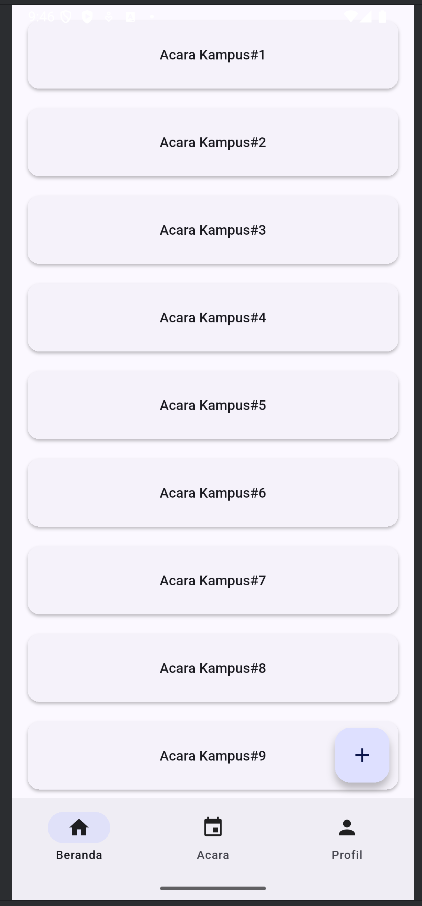
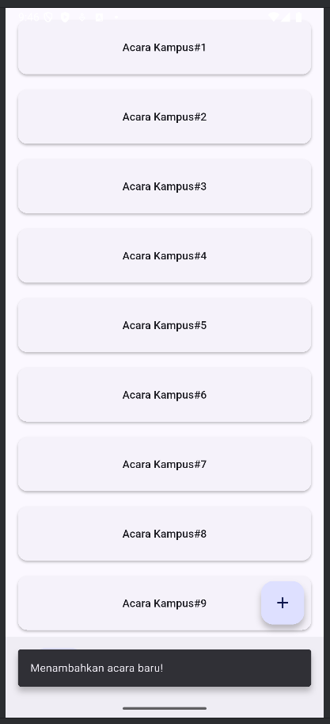

#  Pemrograman Berbasis Mobile  
## Aplikasi Flutter 3 Halaman - Kelompok 1

icon | Nama | NPM |
:---: | :---: | :---: 
| Muhammad Sulthan Zharfan | 4522210016 | `SultanZharfan`

## Tugas
Tambahkan Floating Action Button (FAB) pada tampilan Compact.

## 📸 Screenshot

Berikut adalah tampilan aplikasi saat dijalankan:

